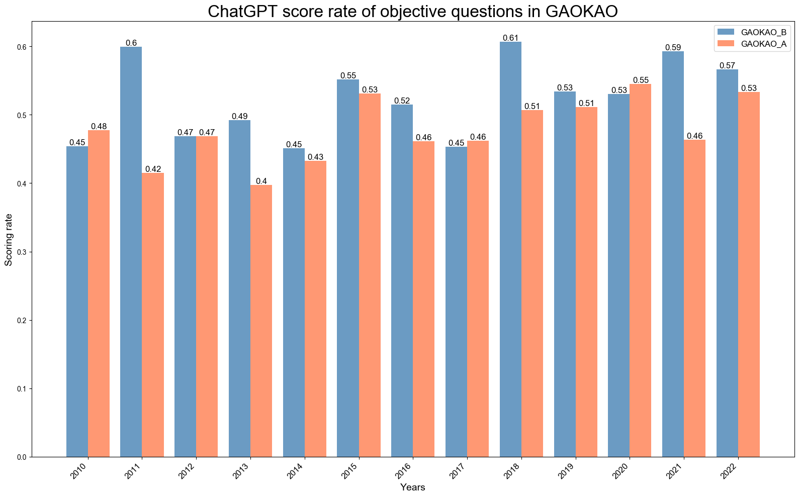
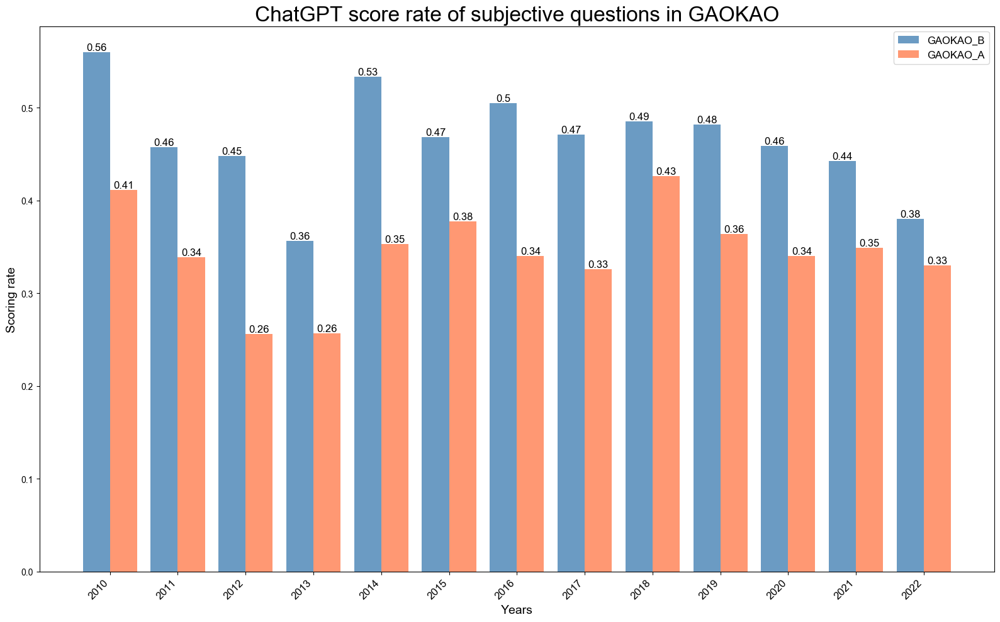
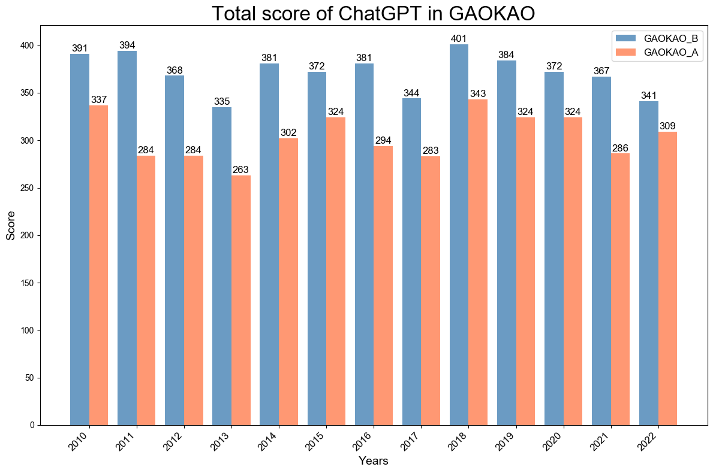

# GAOKAO-bench

GAOKAO-bench是一个以中国高考题目为数据集，测评大模型语言理解能力、逻辑推理能力的测评框架。[[Read In English]](./README_EN.md)
[[paper]](https://arxiv.org/abs/2305.12474)

## 介绍

在过去半年的时间里，openai发布了gpt-3.5-turbo和gpt-4。其展现出的语言理解能力、逻辑推理能力和丰富的语言生成能力令人惊叹。在其强大能力的背后，我们可以看到在大语言模型的背景下传统的模型评测框架难以对这些能力非凡的大模型做出准确的评测。因此我们希望能够建立一个标准化、综合性的评测框架来对大模型进行全方位、准确的评估。在中国，高考是标准化水平最高、综合性最强并且认可度最广的考试之一，我们希望借用高考的题目来评估大模型的能力。因此，我们收集了2010-2022年全国高考卷的题目，其中包括1781道客观题和1030道主观题，构建起GAOKAO-bench的数据部分。

## 数据集

| 题目类型     | 题目数量 | 数量占比 |
| ------------ | -------- | -------- |
| 选择题       | 1781     | 63.36%   |
| 填空题       | 218      | 7.76%    |
| 解答题       | 812      | 28.89%   |
| **题目总数** | **2811** | **100%** |

#### json格式说明

| 字段             | 说明                       |
| ---------------- | -------------------------- |
| keywords         | 题目年份，科目等信息       |
| example          | 题目列表，包含题目具体信息 |
| example/year     | 题目所在高考卷年份         |
| example/category | 题目所在高考卷类型         |
| example/question | 题目题干                   |
| example/answer   | 题目答案                   |
| example/analysis | 题目解析                   |
| example/index    | 题目序号                   |
| example/score    | 题目分值                   |

数据格式如下所示：

```json
        {
            "year": "2010",
            "category": "（新课标）",
            "question": "1．（ 4分）西周分封制在中国历史上影响深远。下列省、自治区中，其简称源\n自西周封国国名的是（ 　　） \nA．河南、河北  B．湖南、湖北  C．山东、山西  D．广东、广西\n",
            "answer": [
                "C"
            ],
            "analysis": "西周分封的诸侯国主要有鲁齐燕卫宋晋 。A项河南的简称是豫 ，河北的\n简称是冀； B项湖南的简称是湘，湖北的简称是鄂； D项广东的简称是粤，\n广西的简称是桂。其简称都不是源自西周封国国名， 故排除 ABD三项。  \nC项山东的简称是鲁 ，山西的简称是晋 ，其简称都是源自西周封国国名 。故C项\n正确。  \n故选： C。\n",
            "index": 0,
            "score": 4
        }
```

## 模型输出

模型输出的格式如下所示：

```json
    {
        "index": 0,
        "year": "2010",
        "category": "（新课标）",
        "question": "1．（ 4分）西周分封制在中国历史上影响深远。下列省、自治区中，其简称源\n自西周封国国名的是（ 　　） \nA．河南、河北  B．湖南、湖北  C．山东、山西  D．广东、广西\n",
        "standard_answer": [
            "C"
        ],
        "analysis": "西周分封的诸侯国主要有鲁齐燕卫宋晋 。A项河南的简称是豫 ，河北的\n简称是冀； B项湖南的简称是湘，湖北的简称是鄂； D项广东的简称是粤，\n广西的简称是桂。其简称都不是源自西周封国国名， 故排除 ABD三项。  \nC项山东的简称是鲁 ，山西的简称是晋 ，其简称都是源自西周封国国名 。故C项\n正确。  \n故选： C。\n",
        "model_answer": [
            "C"
        ],
        "model_output": "【解析】\n西周时期实行的分封制度是指周王朝把自己的领土划分成诸侯国，由周王封授给亲戚、功臣等人，以维护王权，加强中央集权。这些封国的名称多以地理特征、山川、河流、国都等命名，如鲁、卫、楚、秦等。因此，本题考查的是哪个省、自治区的简称源自西周封国国名，根据选项，可以排除D选项，因为广东、广西的简称并非源自西周封国国名。再根据中国地理位置和历史文化背景，可以得出答案。\n【答案】C <eoa>",
    		"score":4
    }
```

***我们强烈建议模型的max tokens不少于4096，否则部分题目的模型输出会出现输出截断的问题。**

## 测试结果

我们统计了gpt-3.5-turbo历年的高考得分：







## 评测

评测框架由如下部分组成：

| 文件名                     | 函数           |
| -------------------------- | -------------- |
| /Bench/choice_bench.py     | 生成选择题答案 |
| /Bench/cloze_bench.py      | 生成填空题     |
| /Bench/subjective_bench.py | 生成解答题答案 |
| /Bench/bench_function.py   | 测试相关函数   |
| /Bench/MCQ_prompt.json     | 选择题prompt   |
| /Bench/FBQ_prompt.json     | 填空题prompt   |
| /Bench/OEQ_prompt.json     | 解答题prompt   |
| /Bench/score_evaluation.py | 客观题能力测评 |
| /models/Moss.py            | 调用Moss接口   |
| /models/Openai.py          | 调用Openai接口 |

------

你可以通过调用不同模型的API运行[choice_bench.py](https://github.com/piglaker/GAOKAO-Bench/blob/main/Bench/choice_bench.py)/[cloze_bench.py](https://github.com/piglaker/GAOKAO-Bench/blob/main/Bench/cloze_bench.py)/[subjective_bench.py](https://github.com/piglaker/GAOKAO-Bench/blob/main/Bench/subjective_bench.py) 以生成答案。我们在[/models](https://github.com/OpenLMLab/GAOKAO-Bench/tree/object/models)文件夹下已经建立了MossAPI和OpenaiAPI。你也可以自定义其他模型API。

最后，你可以运行 [score_evaluation.py](https://github.com/OpenLMLab/GAOKAO-Bench/blob/main/Bench/score_evaluation.py)来得到模型的客观题得分。

## 简单示例

#### Openai API

1. 把你的API_KEY放置在txt文件中，格式如下

   ```
   your_openai_account|your_openai_password|your_api_key
   ```

   放置在 `GAOKAO-Bench/data` 目录下

2. 获取模型输出

   ```
   cd Bench
   python choice_bench.py
   ```

3. 给模型打分

   ```
   python score_evaluation.py
   ```

   你可以得到对应的分数

   ```
   GAOKAO_A_total_score:  364
   GAOKAO_B_total_score:  398
   COMPOSITE_score:  593
   ```

#### 其他模型

1. 封装你的模型API并放置在  `GAOKAO-Bench/models` 目录下，我们定义了MossAPI[Moss.py](https://github.com/OpenLMLab/GAOKAO-Bench/blob/object/models/moss.py) 作为示例。 

   ```python
   class MossAPI:
       def __init__(self, api_key_list: list[str]):
         """
         initiate model_api using api_key_list and other parameters(if needed)
         """
           self.api_key_list = api_key_list
           self.api_url = ""
           
       def send_request(self, api_key: str, request:str, context=None):
         """
         send request to model and receive response from model
         """
           self.headers = {
               "apikey": api_key
           }
           data = {
                   "request": request
           }
           if context:
               data["context"] = context
           response = requests.post(self.api_url, headers=self.headers, json=data)
           return response.json()
   
       def forward(self, request_text:str):
           """
           input a request_text and return the model output 
           """
           while True:
               try:
                   api_key = choice(self.api_key_list)
                   response = self.send_request(api_key, request_text)
                   if 'response' in response.keys():
                       response = response['response']
                       break
   
                   if 'code' in response.keys():
                       print(response['code'])
                       print(response['message'])
                       response = response['message']
                       break
   
               except Exception as e:
                   print('Exception:', e)
                   time.sleep(4)
    
           return response
   
       def __call__(self, prompt, question):
       """
       call the model_api to get the output of the model given a prompt and a question 
       """
           return self.forward(request_text=prompt+question)
   ```

   

2. 在 [choice_bench.py](https://github.com/OpenLMLab/GAOKAO-Bench/blob/main/Bench/choice_bench.py)中导入你的模型API类并实例化。执行下述指令生成模型的答案

   ```
   cd Bench
   python choice_bench.py
   ```

   

3. 使用你的模型生成 `Multiple-choice_Questions` 目录下题目的答案。模型输出的格式如上文所述，文件名命名为 `"model_name_question_name.json"`，并把它放置在 `GAOKAO-Bench/data` 目录下，如下所示

```
data/
├── moss_2010-2022_English_Fill_in_Blanks.json
├── moss_2010-2022_Chinese_Lang_and_Usage_MCQs.json
├── moss_2010-2022_Physics_MCQs.json
├── moss_2010-2022_Political_Science_MCQs.json
├── moss_2010-2022_Math_I_MCQs.json
├── moss_2010-2022_Biology_MCQs.json
├── moss_2010-2013_English_MCQs.json
├── moss_2010-2022_Geography_MCQs.json
├── moss_2010-2022_Chemistry_MCQs.json
├── moss_2010-2022_Math_II_MCQs.json
├── moss_2012-2022_English_Cloze_Test.json
├── moss_2010-2022_History_MCQs.json
├── moss_2010-2022_Chinese_Modern_Lit.json
└── moss_2010-2022_English_Reading_Comp.json
```

4. 执行上述第三步

## 依赖

```
joblib==1.1.0
openai==0.27.2
```

## 引用

```
@inproceedings{Zhang2023EvaluatingTP,
  title={Evaluating the Performance of Large Language Models on GAOKAO Benchmark},
  author={Xiaotian Zhang and Chunyang Li and Yi Zong and Zhengyu Ying and Liang He and Xipeng Qiu},
  year={2023}
}
```

## 致谢

我们非常感谢上海市曹杨第二中学的老师们，他们负责了GAOKAO-Bench主观题部分的评分。

