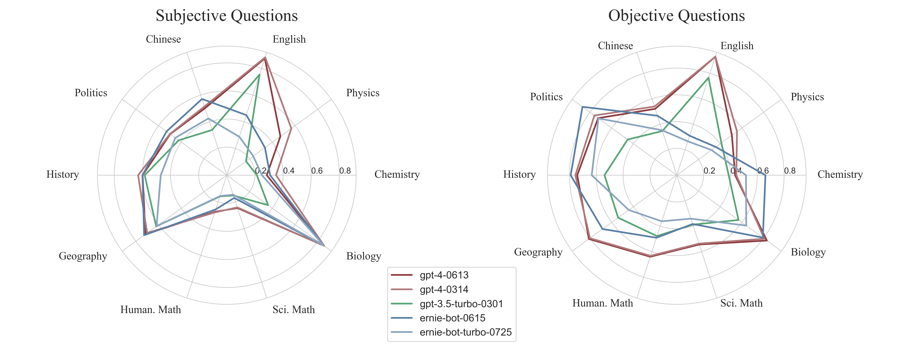

# GAOKAO-Bench

GAOKAO-Bench是一个以中国高考题目为数据集，测评大模型语言理解能力、逻辑推理能力的测评框架。[[Read In English]](./README_EN.md)[[paper]](https://arxiv.org/abs/2305.12474)

## 更新

[[GAOKAO-MM]](https://github.com/OpenMOSS/GAOKAO-MM)：基于中国高考题的多模态数据集，测评多模态模型的感知、理解、知识、推理能力。

[[GAOKAO-Bench-2023]](https://github.com/OpenLMLab/GAOKAO-Bench-2023):将中国2023年高考选择题作为数据集 ，对GAOKAO-Bench的补充。

## 介绍

我们希望能够建立一个标准化、综合性的评测框架来对大模型进行全方位、准确的评估。在中国，高考是标准化水平最高、综合性最强并且认可度最广的考试之一，我们希望借用高考的题目来评估大模型的能力。因此，我们收集了2010-2022年全国高考卷的题目，其中包括1781道客观题和1030道主观题，构建起GAOKAO-Bench的数据部分。

## 数据集

| 题目类型     | 题目数量 | 数量占比 |
| ----------------- | ------------- | ------------- |
| 客观题       | 1781     | 63.36%   |
| 主观题       | 1030     | 36.64%   |
| **题目总数** | **2811** | **100%** |

数据示例如下所示：

- **Year**

> 2022

- **Category**

> 全国甲卷
>

- **Score**

> 5

- **Question**

> 若 $z=-1+\sqrt{3} \mathrm{i}$, 则 $\frac{z}{z \bar{z}-1}=()$
>
> A. $-1+\sqrt{3} \mathrm{i}$	
>
> B. $-1-\sqrt{3} i$	
>
> C. $-\frac{1}{3}+\frac{\sqrt{3}}{3} \mathrm{i}$
>
> D. $-\frac{1}{3}-\frac{\sqrt{3}}{3} i$
>

- **Analysis**

> 【详解】
>
> $\bar{z}=-1-\sqrt{3} i, z \bar{z}=(-1+\sqrt{3} i)(-1-\sqrt{3} i)=1+3=4$.
>
> $\frac{z}{z \bar{z}-1}=\frac{-1+\sqrt{3} \mathrm{i}}{3}=-\frac{1}{3}+\frac{\sqrt{3}}{3} \mathrm{i}$
>
> 故选: C
>

* **Standard Answer**

> C

## 测试结果

### 高考总分

我们采用zero-shot的方式测试各项模型，对客观题采用基于规则的答案抽取方式，对主观题采取人工评阅的方式，最终获得了GPT-4、GPT-3.5等模型的转化后的高考总分。实验结果表明，GPT-4转换后的高考总分名列第一，文科和理科总分分别为485和447。同时，所有模型的文科成绩都高于理科成绩。





### 客观题得分率

| **Models**                                    | **Overall** | **Chinese** | **Eng.**  | **Sci. Math** | **Hum. Math** | **Phys.** | **Chem.** | **Biol.** | **Poli.** | **Hist.** | **Geog.** |
| --------------------------------------------- | ----------- | ----------- | --------- | ------------- | ------------- | --------- | --------- | --------- | --------- | --------- | --------- |
| **GPT-4-0314**                                | **72.2%**   | **53.9%**   | 93.1%     | 53.7%         | 63.3%         | **55.5%** | 44.4%     | 80.7%     | 75.9%     | 75.6%     | 80.0%     |
| **GPT-4-0613**                                | 71.6%       | 52.1%       | **93.2%** | **54.5%**     | **64.0%**     | 50.8%     | 43.6%     | **83.0%** | 72.5%     | 74.2%     | **81.1%** |
| **Gemini-Pro**                                | 57.9%       | 46.7%       | 69.9%     | 40.7%         | 47.7%         | 32.0%     | 40.3%     | 70.7%     | 64.7%     | 64.5%     | 68.4%     |
| **ERNIE-Bot-0615**                            | 56.6%       | 46.7%       | 31.0%     | 38.3%         | 49.1%         | 35.9%     | **66.1%** | 79.3%     | **86.9%** | **79.1%** | 68.4%     |
| **GPT-3.5-turbo-0301**                        | 53.2%       | 34.7%       | 76.6%     | 38.8%         | 47.8%         | 41.1%     | 38.7%     | 56.9%     | 45.3%     | 53.9%     | 54.0%     |
| **ERNIE-Bot-turbo-0725**                      | 45.6%       | 35.3%       | 26.6%     | 34.1%         | 36.2%         | 32.0%     | 51.6%     | 64.0%     | 72.2%     | 63.4%     | 44.2%     |
| **Baichuan2-13b-Chat**                        | 43.9%       | 26.9%       | 34.7%     | 23.8%         | 31.7%         | 25.0%     | 40.3%     | 53.3%     | 75.3%     | 59.9%     | 61.1%     |
| **ChatGLM2-6b**                               | 42.7%       | 31.1%       | 30.6%     | 29.0%         | 35.8%         | 24.2%     | 46.0%     | 71.3%     | 55.0%     | 59.2%     | 41.1%     |
| **Baichuan2-7b-Chat**                         | 40.5%       | 31.7%       | 33.0%     | 26.6%         | 28.4%         | 18.0%     | 26.6%     | 48.0%     | 69.7%     | 57.8%     | 49.5%     |
| **ChatGLM-6b**                                | 30.8%       | 18.6%       | 17.0%     | 25.2%         | 25.7%         | 12.5%     | 30.6%     | 24.7%     | 54.1%     | 59.9%     | 25.3%     |
| **Baichuan2-7b-Base**                         | 27.2%       | 16.2%       | 21.2%     | 24.8%         | 24.8%         | 0.0%      | 23.4%     | 24.0%     | 55.3%     | 32.1%     | 24.2%     |
| **LLaMA-7b**                                  | 21.1%       | 16.2%       | 20.5%     | 24.3%         | 26.1%         | 0.0%      | 22.6%     | 22.7%     | 22.2%     | 19.2%     | 24.2%     |
| **Vicuna-7b**                                 | 21.0%       | 12.0%       | 19.6%     | 23.8%         | 23.4%         | 7.0%      | 27.4%     | 20.0%     | 20.9%     | 23.0%     | 23.2%     |

### 主观题得分率

| **Models**                                    | **Overall** | **Chinese** | **Eng.**  | **Sci. Math** | **Hum. Math** | **Phys.** | **Chem.** | **Biol.** | **Poli.** | **Hist.** | **Geog.** |
| --------------------------------------------- | ----------- | ----------- | --------- | ------------- | ------------- | --------- | --------- | --------- | --------- | --------- | --------- |
| **GPT-4-0314**                                | **51.9%**   | 51.5%       | **88.3%** | 24.1%         | **27.9%**     | **56.7%** | **35.0%** | **85.6%** | 50.0%     | **63.1%** | 70.0%     |
| **GPT-4-0613**                                | 50.8%       | 50.3%       | 87.6%     | **24.6%**     | 27.5%         | 47.1%     | 28.5%     | **85.6%** | 49.9%     | 59.9%     | 71.5%     |
| **ERNIE-Bot-0615**                            | 48.4%       | **57.1%**   | 45.0%     | 17.0%         | 25.6%         | 33.5%     | 30.8%     | 84.9%     | **53.0%** | 60.0%     | **72.7%** |
| **ERNIE-Bot-turbo-0725**                      | 39.2%       | 42.5%       | 28.8%     | 14.6%         | 15.6%         | 23.2%     | 25.0%     | 85.1%     | 45.3%     | 47.0%     | 61.8%     |
| **GPT-3.5-turbo-0301**                        | 35.8%       | 33.9%       | 75.4%     | 15.2%         | 15.9%         | 16.9%     | 21.4%     | 36.3%     | 42.3%     | 58.4%     | 62.1%     |

## 简单示例

#### Openai API

1. 获取GPT-4模型输出

   ```
   cd ./Bench
   
   ## Get the Output of Objective Questions
   python objective_bench.py --openai_api_key="your openai api key"
   
   ## Get the Output of Subjective Questions
   python subjective_bench.py --openai_api_key="your openai api key"
   ```

2. 计算GPT-4模型客观题得分率

   * 将GPT-4模型输出的JSON文件存放在`./Results/gpt_4_obj`文件夹下。

   * 执行以下指令，获得其客观题的得分率，结果存放在`./Results/gpt_4_obj/result/correction_score.json`文件下。
   
   ```
   python OBJ_score_evaluation.py --obj_output_dir=../Results/gpt_4_obj
   ```

3. 计算GPT-4模型主观题得分率

   由于人工批改的高昂成本，我们提供了LLM-as-a-Judge脚本，利用GPT-4-turbo为模型的主观题打分。

   * 将GPT-4模型输出的JSON文件存放在`./Results/gpt_4_sub`文件夹下。

   * 执行以下指令，获得GPT-4对主观题的评分，结果存放在`./Results/gpt_4_sub/gpt-4-1106-preview_correction_wo_marking_criterion`文件下。

   ```
   python subjective_grade.py --openai_api_key="your openai api key"
   ```

   * 执行以下指令，获得其主观题的得分率，结果存放在`./Results/gpt_4_sub/gpt-4-1106-preview_correction_wo_marking_criterion/result/model_score.json`文件下。

     ```
     python SUB_score_evaluation.py --sub_output_dir=../Results/gpt_4_sub/gpt-4-1106-preview_correction_wo_marking_criterion --mode=model
     ```

4. 计算GPT-4模型高考总分

   执行以下指令，获得GPT-4转换后的高考总分，结果保存在`./Results/merge_score.json`下。

   ```
   python merge_OBJ_SUB_score.py
   ```

   

#### 其他模型

封装你的模型API并放置在  `./Models` 目录下，封装方式可参考`./Models/openai_gpt4.py`。

## 引用

```
@inproceedings{Zhang2023EvaluatingTP,
  title={Evaluating the Performance of Large Language Models on GAOKAO Benchmark},
  author={Xiaotian Zhang and Chunyang Li and Yi Zong and Zhengyu Ying and Liang He and Xipeng Qiu},
  year={2023}
}
```

## 致谢

我们非常感谢上海市曹杨第二中学的老师们，他们负责了GAOKAO-Bench主观题部分的评分。

